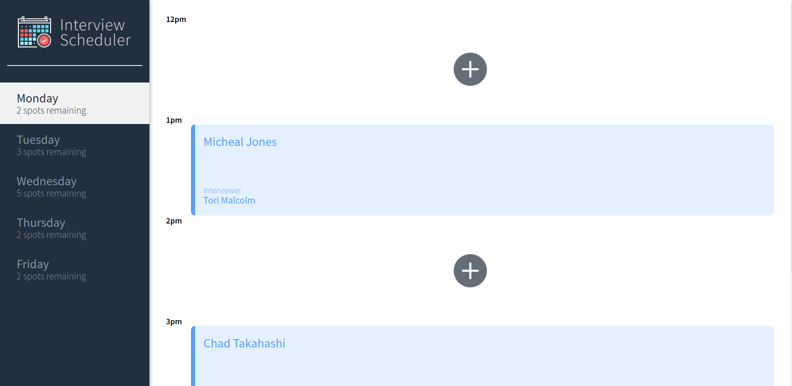
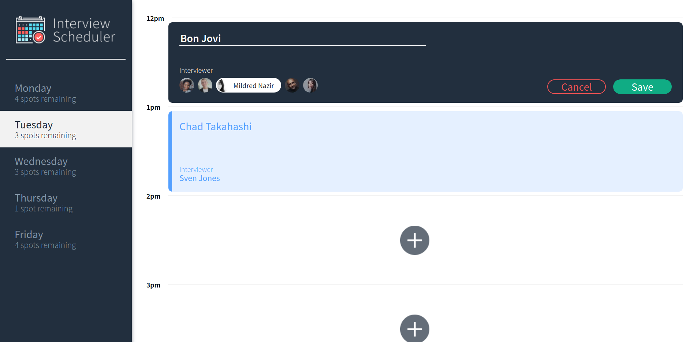
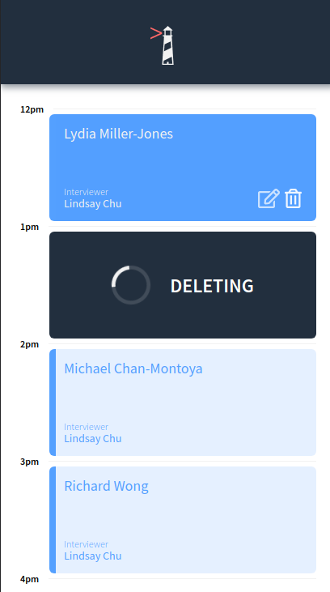

# Interview Scheduler

## What is Interview Scheduler?

Interview Scheduler is a blazing-fast single-page application built with React.js that allows users to schedule interviews with their mentors throughout the days in a week.
It's focus is on providing a fluid, easy-to-use experience in real time.

The project runs paired with an API server and a regenerating database via PostgreSQL. To find out more about what Interview Scheduler has to offer, check out some of it's features below.

## Features

- Interviews can be booked between Monday and Friday.
- A user can switch between weekdays.
- A user can book an interview in an empty appointment slot.
- Interviews are booked by typing in a student name and clicking on an interviewer from a list of available interviewers.
- A user can cancel an existing interview.
- A user can edit the details of an existing interview.
- The list of days informs the user how many slots are available for each day.
- The expected day updates the number of spots available when an interview is booked or canceled.
- A user is presented with a confirmation when they attempt to cancel an interview.
- A user is shown an error if an interview cannot be saved or deleted.
- A user is shown a status indicator while asynchronous operations are in progress.
- When the user presses the close button of the error they are returned to the Form or Show view (skipping Status and Confirm).
- The application makes API requests to load and persist data. We do not lose data after a browser refresh.

## Dashboard (Monday)



## Creating an Appointment



## Deleting an Appointment



# Setup

Install dependencies with `npm install`.

## Running Webpack Development Server

```sh
npm start
```

## Running Jest Test Framework

```sh
npm test
```

## Running Storybook Visual Testbed

```sh
npm run storybook
```

## Dependencies

- axios (0.21.1)
- babel (6.23.0)
- classnames (2.3.1)
- cypress (8.2.0)
- normalize.css (8.0.1)
- react (16.9.0)
- react-dom (16.9.0)
- react-hooks-testing-library (0.6.0)
- react-scripts (4.0.0)
- react-test-renderer (17.0.2)
- @storybook/addon-essentials (6.3.6)
- @storybook/addon-links (6.3.6)
- @storybook/addons (6.3.6)
- @storybook/node-logger (6.3.6)
- @storybook/preset-create-react-app (3.2.0)
- @storybook/react (6.3.6)
- @testing-library/jest-dom (4.0.0)
- @testing-library/react (12.0.0)
- node-sass (4.14.0)
